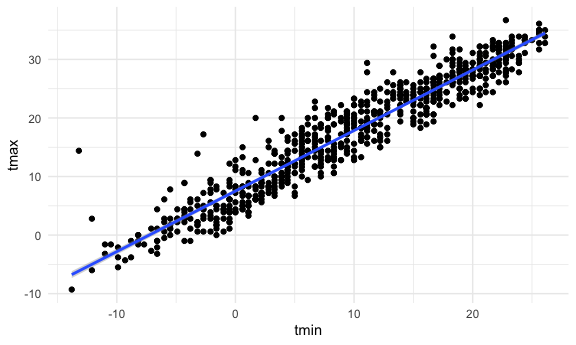

iteration and list columns
================
Mukta Patwari
2025-10-28

## Lists

``` r
l =
  list(
    vec_numeric = 1:23,
    char_vec = c("Mukta"),
    mat = matrix(1:8, nrow = 2, ncol = 4),
    summary = summary(rnorm(1000, mean = 4))
  )
```

## Make a different list

``` r
list_normals =
  list(
    a = rnorm(30, mean = 3, sd = 1),
    b = rnorm(30, mean = 30, sd = 1.5),
    c = rnorm(30, mean = 5, sd = 2),
    d = rnorm(30, mean = 10, sd = 0.5)
  )
```

(copy and paste function from last time)

``` r
mean_and_sd = function(x) {
  
  if (!is.numeric(x)) {
    stop("Argument x should be numeric")
  } 
  
  if (length(x) < 5) {
    stop("Only compute mean and sd when the input has 5 or more numbers")
  }
  
  mean_x = mean(x)
  sd_x = sd(x)

  tibble(
    mean = mean_x, 
    sd = sd_x
  )
}
```

``` r
mean_and_sd(list_normals[[1]])
```

    ## # A tibble: 1 × 2
    ##    mean    sd
    ##   <dbl> <dbl>
    ## 1  2.80  1.04

``` r
mean_and_sd(list_normals[[2]])
```

    ## # A tibble: 1 × 2
    ##    mean    sd
    ##   <dbl> <dbl>
    ## 1  30.4  1.33

``` r
mean_and_sd(list_normals[[3]])
```

    ## # A tibble: 1 × 2
    ##    mean    sd
    ##   <dbl> <dbl>
    ## 1  4.58  2.11

``` r
mean_and_sd(list_normals[[4]])
```

    ## # A tibble: 1 × 2
    ##    mean    sd
    ##   <dbl> <dbl>
    ## 1  9.99 0.475

Use loops to iterate

``` r
output = vector("list", length = 4)

for (i in 1:4) {
  
  output[[i]] = mean_and_sd(list_normals[[i]])
  
}

output
```

    ## [[1]]
    ## # A tibble: 1 × 2
    ##    mean    sd
    ##   <dbl> <dbl>
    ## 1  2.80  1.04
    ## 
    ## [[2]]
    ## # A tibble: 1 × 2
    ##    mean    sd
    ##   <dbl> <dbl>
    ## 1  30.4  1.33
    ## 
    ## [[3]]
    ## # A tibble: 1 × 2
    ##    mean    sd
    ##   <dbl> <dbl>
    ## 1  4.58  2.11
    ## 
    ## [[4]]
    ## # A tibble: 1 × 2
    ##    mean    sd
    ##   <dbl> <dbl>
    ## 1  9.99 0.475

Use `map` to do the same thing

``` r
output = map(list_normals, mean_and_sd)

output = map(list_normals, median)
```

Check out some `map` variants

``` r
map_dfr(list_normals, mean_and_sd, .id = "sample")
```

    ## # A tibble: 4 × 3
    ##   sample  mean    sd
    ##   <chr>  <dbl> <dbl>
    ## 1 a       2.80 1.04 
    ## 2 b      30.4  1.33 
    ## 3 c       4.58 2.11 
    ## 4 d       9.99 0.475

``` r
map_dbl(list_normals, median)
```

    ##         a         b         c         d 
    ##  2.804539 30.281459  4.816278 10.016170

### LIST COLUMNS

put list into dataframe

``` r
listcol_df =
  tibble(
    name = c("a","b", "c", "d"),
    sample = list_normals
  )
```

checking if it works or not

``` r
pull(listcol_df, name)
```

    ## [1] "a" "b" "c" "d"

``` r
pull(listcol_df, sample)
```

    ## $a
    ##  [1] 4.134965 4.111932 2.129222 3.210732 3.069396 1.337351 3.810840 1.087654
    ##  [9] 1.753247 3.998154 2.459127 2.783624 1.378063 1.549036 3.350910 2.825453
    ## [17] 2.408572 1.665973 1.902701 5.036104 2.673510 3.774005 3.785006 3.763246
    ## [25] 3.294809 1.747644 1.990496 3.751391 1.691646 3.527540
    ## 
    ## $b
    ##  [1] 29.19969 29.40244 28.81565 29.65479 31.31578 30.68060 29.65130 31.30501
    ##  [9] 32.48401 29.99045 30.70573 30.41733 28.53315 28.61012 32.87966 31.32192
    ## [17] 31.11312 30.22136 30.72808 30.22778 30.06300 30.33513 28.48430 33.60183
    ## [25] 31.20294 29.62319 31.81933 29.05911 32.56674 29.40844
    ## 
    ## $c
    ##  [1] 0.3570183 7.7282384 7.2644583 3.4513674 2.1792501 1.3309448 4.4619729
    ##  [8] 1.3321428 3.3710640 5.3271442 6.7110384 3.3600737 4.7527945 5.5098965
    ## [15] 8.4378527 3.0829129 1.7913795 1.3087812 6.1114744 4.8797616 6.5441726
    ## [22] 4.7183212 5.7861879 5.4484371 5.0470840 3.7540747 7.5240188 4.1884519
    ## [29] 6.3335275 5.3292783
    ## 
    ## $d
    ##  [1] 10.890762 10.355607  9.831154  9.995426  9.937345  8.954577 10.848697
    ##  [8] 10.531941  9.616692 10.191004 10.120948  9.433620 10.744954  9.875876
    ## [15] 10.091792 10.202436  9.502938  9.457285  9.975729 10.288043 10.036915
    ## [22] 10.352973 10.167490 10.272694  9.298547 10.338527  9.605100  9.767136
    ## [29]  9.947574  9.176074

can i apply `mean_and_sd`

``` r
mean_and_sd(pull(listcol_df, sample)[[1]])
```

    ## # A tibble: 1 × 2
    ##    mean    sd
    ##   <dbl> <dbl>
    ## 1  2.80  1.04

``` r
mean_and_sd(pull(listcol_df, sample)[[2]])
```

    ## # A tibble: 1 × 2
    ##    mean    sd
    ##   <dbl> <dbl>
    ## 1  30.4  1.33

``` r
mean_and_sd(pull(listcol_df, sample)[[3]])
```

    ## # A tibble: 1 × 2
    ##    mean    sd
    ##   <dbl> <dbl>
    ## 1  4.58  2.11

``` r
mean_and_sd(pull(listcol_df, sample)[[4]])
```

    ## # A tibble: 1 × 2
    ##    mean    sd
    ##   <dbl> <dbl>
    ## 1  9.99 0.475

iterate using `map`

``` r
map(pull(listcol_df, sample), mean_and_sd)
```

    ## $a
    ## # A tibble: 1 × 2
    ##    mean    sd
    ##   <dbl> <dbl>
    ## 1  2.80  1.04
    ## 
    ## $b
    ## # A tibble: 1 × 2
    ##    mean    sd
    ##   <dbl> <dbl>
    ## 1  30.4  1.33
    ## 
    ## $c
    ## # A tibble: 1 × 2
    ##    mean    sd
    ##   <dbl> <dbl>
    ## 1  4.58  2.11
    ## 
    ## $d
    ## # A tibble: 1 × 2
    ##    mean    sd
    ##   <dbl> <dbl>
    ## 1  9.99 0.475

adding a column

``` r
listcol_df =
  listcol_df %>% 
  mutate(
    summary = map(sample, mean_and_sd)
  )

pull(listcol_df, summary)
```

    ## $a
    ## # A tibble: 1 × 2
    ##    mean    sd
    ##   <dbl> <dbl>
    ## 1  2.80  1.04
    ## 
    ## $b
    ## # A tibble: 1 × 2
    ##    mean    sd
    ##   <dbl> <dbl>
    ## 1  30.4  1.33
    ## 
    ## $c
    ## # A tibble: 1 × 2
    ##    mean    sd
    ##   <dbl> <dbl>
    ## 1  4.58  2.11
    ## 
    ## $d
    ## # A tibble: 1 × 2
    ##    mean    sd
    ##   <dbl> <dbl>
    ## 1  9.99 0.475

``` r
listcol_df %>% 
  select(-sample) %>% 
  unnest(summary)
```

    ## # A tibble: 4 × 3
    ##   name   mean    sd
    ##   <chr> <dbl> <dbl>
    ## 1 a      2.80 1.04 
    ## 2 b     30.4  1.33 
    ## 3 c      4.58 2.11 
    ## 4 d      9.99 0.475

## Revisit NSDUH

``` r
nsduh_url = "http://samhda.s3-us-gov-west-1.amazonaws.com/s3fs-public/field-uploads/2k15StateFiles/NSDUHsaeShortTermCHG2015.htm"

nsduh_html = read_html(nsduh_url)

nsduh_import = function(html, table_num) {
  
  data = 
    html |> 
    html_table() |> 
    nth(table_num) |>
    slice(-1) |> 
    select(-contains("P Value")) |>
    pivot_longer(
      -State,
      names_to = "age_year", 
      values_to = "percent") |>
    separate(age_year, into = c("age", "year"), sep = "\\(") |>
    mutate(
      year = str_replace(year, "\\)", ""),
      percent = str_replace(percent, "[a-c]$", ""),
      percent = as.numeric(percent)) |>
    filter(!(State %in% c("Total U.S.", "Northeast", "Midwest", "South", "West")))
  
  data
  
}

nsduh_import(nsduh_html, table_num = 1)
```

    ## # A tibble: 510 × 4
    ##    State   age   year      percent
    ##    <chr>   <chr> <chr>       <dbl>
    ##  1 Alabama 12+   2013-2014    9.98
    ##  2 Alabama 12+   2014-2015    9.6 
    ##  3 Alabama 12-17 2013-2014    9.9 
    ##  4 Alabama 12-17 2014-2015    9.71
    ##  5 Alabama 18-25 2013-2014   27.0 
    ##  6 Alabama 18-25 2014-2015   26.1 
    ##  7 Alabama 26+   2013-2014    7.1 
    ##  8 Alabama 26+   2014-2015    6.81
    ##  9 Alabama 18+   2013-2014    9.99
    ## 10 Alabama 18+   2014-2015    9.59
    ## # ℹ 500 more rows

``` r
nsduh_import(nsduh_html, table_num = 2)
```

    ## # A tibble: 510 × 4
    ##    State   age   year      percent
    ##    <chr>   <chr> <chr>       <dbl>
    ##  1 Alabama 12+   2013-2014    5.57
    ##  2 Alabama 12+   2014-2015    5.35
    ##  3 Alabama 12-17 2013-2014    4.98
    ##  4 Alabama 12-17 2014-2015    5.16
    ##  5 Alabama 18-25 2013-2014   15.0 
    ##  6 Alabama 18-25 2014-2015   14.3 
    ##  7 Alabama 26+   2013-2014    4.03
    ##  8 Alabama 26+   2014-2015    3.86
    ##  9 Alabama 18+   2013-2014    5.63
    ## 10 Alabama 18+   2014-2015    5.37
    ## # ℹ 500 more rows

``` r
nsduh_import(nsduh_html, table_num = 3)
```

    ## # A tibble: 510 × 4
    ##    State   age   year      percent
    ##    <chr>   <chr> <chr>       <dbl>
    ##  1 Alabama 12+   2013-2014    1.42
    ##  2 Alabama 12+   2014-2015    1.49
    ##  3 Alabama 12-17 2013-2014    4.46
    ##  4 Alabama 12-17 2014-2015    4.36
    ##  5 Alabama 18-25 2013-2014    6.04
    ##  6 Alabama 18-25 2014-2015    6.39
    ##  7 Alabama 26+   2013-2014    0.15
    ##  8 Alabama 26+   2014-2015    0.2 
    ##  9 Alabama 18+   2013-2014    0.95
    ## 10 Alabama 18+   2014-2015    1.05
    ## # ℹ 500 more rows

try this iwth a `for` loop

``` r
output = vector("list", length = 3)

for (i in 1:3) {
  output[[i]] = nsduh_import(html = nsduh_html, i)
}
```

Do this with `map`

``` r
map(1:3, nsduh_import, html = nsduh_html)
```

    ## [[1]]
    ## # A tibble: 510 × 4
    ##    State   age   year      percent
    ##    <chr>   <chr> <chr>       <dbl>
    ##  1 Alabama 12+   2013-2014    9.98
    ##  2 Alabama 12+   2014-2015    9.6 
    ##  3 Alabama 12-17 2013-2014    9.9 
    ##  4 Alabama 12-17 2014-2015    9.71
    ##  5 Alabama 18-25 2013-2014   27.0 
    ##  6 Alabama 18-25 2014-2015   26.1 
    ##  7 Alabama 26+   2013-2014    7.1 
    ##  8 Alabama 26+   2014-2015    6.81
    ##  9 Alabama 18+   2013-2014    9.99
    ## 10 Alabama 18+   2014-2015    9.59
    ## # ℹ 500 more rows
    ## 
    ## [[2]]
    ## # A tibble: 510 × 4
    ##    State   age   year      percent
    ##    <chr>   <chr> <chr>       <dbl>
    ##  1 Alabama 12+   2013-2014    5.57
    ##  2 Alabama 12+   2014-2015    5.35
    ##  3 Alabama 12-17 2013-2014    4.98
    ##  4 Alabama 12-17 2014-2015    5.16
    ##  5 Alabama 18-25 2013-2014   15.0 
    ##  6 Alabama 18-25 2014-2015   14.3 
    ##  7 Alabama 26+   2013-2014    4.03
    ##  8 Alabama 26+   2014-2015    3.86
    ##  9 Alabama 18+   2013-2014    5.63
    ## 10 Alabama 18+   2014-2015    5.37
    ## # ℹ 500 more rows
    ## 
    ## [[3]]
    ## # A tibble: 510 × 4
    ##    State   age   year      percent
    ##    <chr>   <chr> <chr>       <dbl>
    ##  1 Alabama 12+   2013-2014    1.42
    ##  2 Alabama 12+   2014-2015    1.49
    ##  3 Alabama 12-17 2013-2014    4.46
    ##  4 Alabama 12-17 2014-2015    4.36
    ##  5 Alabama 18-25 2013-2014    6.04
    ##  6 Alabama 18-25 2014-2015    6.39
    ##  7 Alabama 26+   2013-2014    0.15
    ##  8 Alabama 26+   2014-2015    0.2 
    ##  9 Alabama 18+   2013-2014    0.95
    ## 10 Alabama 18+   2014-2015    1.05
    ## # ℹ 500 more rows

do this all in a dataframe.

``` r
nsduh_df =
  tibble(
    name = c("marj use year", "marj use month", "marj first use"),
    number = 1:3
  ) %>% 
  mutate(
    table = map(number, nsduh_import, html = nsduh_html)
  ) %>% 
  unnest(table)
```

## Look at weather data

``` r
library(p8105.datasets)
data("weather_df")
```

``` r
weather_df %>% 
  filter(name == "CentralPark_NY") %>% 
  ggplot(aes(x = tmin, y = tmax)) +
  geom_point() +
  geom_smooth(method = "lm")
```

    ## `geom_smooth()` using formula = 'y ~ x'



Let’s do a regression

``` r
weather_df %>% 
  filter(name == "CentralPark_NY") %>% 
  lm(tmax ~ tmin, data = .)
```

    ## 
    ## Call:
    ## lm(formula = tmax ~ tmin, data = .)
    ## 
    ## Coefficients:
    ## (Intercept)         tmin  
    ##       7.514        1.034

``` r
weather_df %>% 
  filter(name == "Molokai_HI") %>% 
  lm(tmax ~ tmin, data = .)
```

    ## 
    ## Call:
    ## lm(formula = tmax ~ tmin, data = .)
    ## 
    ## Coefficients:
    ## (Intercept)         tmin  
    ##     21.7547       0.3222

``` r
weather_df %>% 
  filter(name == "Waterhole_WA") %>% 
  lm(tmax ~ tmin, data = .)
```

    ## 
    ## Call:
    ## lm(formula = tmax ~ tmin, data = .)
    ## 
    ## Coefficients:
    ## (Intercept)         tmin  
    ##       7.532        1.137

Let’s iterate differently

``` r
weather_nest =
  weather_df %>% 
  nest(data = date:tmin)
```

``` r
lm(tmax ~ tmin, data = pull(weather_nest, data)[[1]])
```

    ## 
    ## Call:
    ## lm(formula = tmax ~ tmin, data = pull(weather_nest, data)[[1]])
    ## 
    ## Coefficients:
    ## (Intercept)         tmin  
    ##       7.514        1.034

``` r
lm(tmax ~ tmin, data = pull(weather_nest, data)[[2]])
```

    ## 
    ## Call:
    ## lm(formula = tmax ~ tmin, data = pull(weather_nest, data)[[2]])
    ## 
    ## Coefficients:
    ## (Intercept)         tmin  
    ##     21.7547       0.3222

``` r
lm(tmax ~ tmin, data = pull(weather_nest, data)[[3]])
```

    ## 
    ## Call:
    ## lm(formula = tmax ~ tmin, data = pull(weather_nest, data)[[3]])
    ## 
    ## Coefficients:
    ## (Intercept)         tmin  
    ##       7.532        1.137

Do this using `map`

``` r
weather_lm = function(df) {
  
  lm(tmax ~ tmin, data = df)
  
}

map(pull(weather_nest, data), weather_lm)
```

    ## [[1]]
    ## 
    ## Call:
    ## lm(formula = tmax ~ tmin, data = df)
    ## 
    ## Coefficients:
    ## (Intercept)         tmin  
    ##       7.514        1.034  
    ## 
    ## 
    ## [[2]]
    ## 
    ## Call:
    ## lm(formula = tmax ~ tmin, data = df)
    ## 
    ## Coefficients:
    ## (Intercept)         tmin  
    ##     21.7547       0.3222  
    ## 
    ## 
    ## [[3]]
    ## 
    ## Call:
    ## lm(formula = tmax ~ tmin, data = df)
    ## 
    ## Coefficients:
    ## (Intercept)         tmin  
    ##       7.532        1.137

``` r
weather_nest %>% 
  mutate(
    lm_fits = map(data, weather_lm)
  )
```

    ## # A tibble: 3 × 4
    ##   name           id          data               lm_fits
    ##   <chr>          <chr>       <list>             <list> 
    ## 1 CentralPark_NY USW00094728 <tibble [730 × 4]> <lm>   
    ## 2 Molokai_HI     USW00022534 <tibble [730 × 4]> <lm>   
    ## 3 Waterhole_WA   USS0023B17S <tibble [730 × 4]> <lm>
