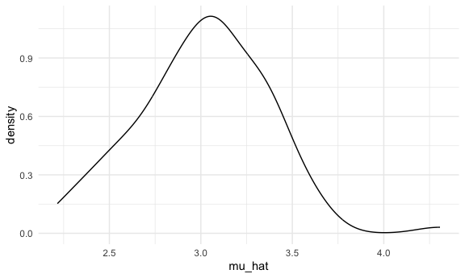
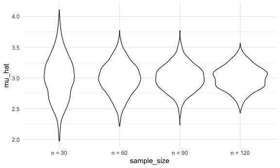
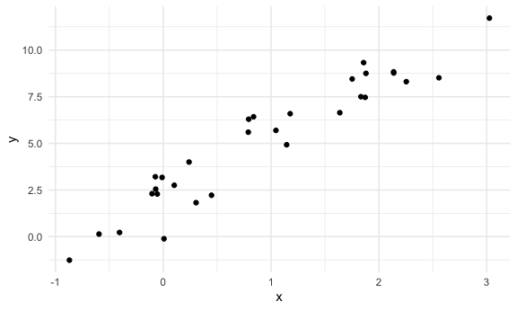
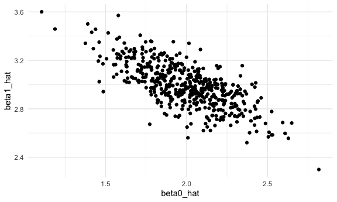
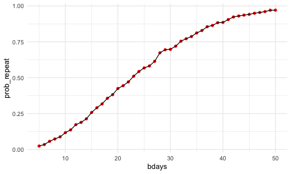

simulation
================
Mukta Patwari
2025-10-30

Load source files

``` r
source("source/sim_mean_sd.R")
```

We can “simulate” by running our function

``` r
sim_mean_and_sd(n_subj = 400)
```

    ## # A tibble: 1 × 2
    ##   mu_hat sigma_hat
    ##    <dbl>     <dbl>
    ## 1   3.08      1.94

can i “verify” CLT?

``` r
output = vector("list", length = 100)

for (i in 1:100) {
  
  output[[i]] = sim_mean_and_sd(30)
}

output %>% 
  bind_rows() %>% 
  ggplot(aes(x = mu_hat)) +
  geom_density()
```



Try to repeat w/ a map statement

``` r
sim_results_df =
  expand_grid(
    sample_size = c(30, 60, 90, 120),
    iter = 1:1000
  ) %>% 
  mutate(
    results = map(sample_size, sim_mean_and_sd)
  ) %>% 
  unnest(results)
```

Let’s look at this:

``` r
sim_results_df %>% 
  mutate(
    sample_size = str_c("n = ", sample_size),
    sample_size = fct_inorder(sample_size)
  ) %>% 
  ggplot(aes(x = sample_size, y = mu_hat, fill = sample_size)) +
  geom_violin()
```



Let’s try to summarize

``` r
sim_results_df %>% 
  group_by(sample_size) %>% 
  summarize(
    emp_mean = mean(mu_hat),
    emp_se = sd(mu_hat)
  )
```

    ## # A tibble: 4 × 3
    ##   sample_size emp_mean emp_se
    ##         <dbl>    <dbl>  <dbl>
    ## 1          30     3.00  0.357
    ## 2          60     2.99  0.257
    ## 3          90     3.00  0.216
    ## 4         120     3.00  0.190

## Simple linear regression

``` r
sim_df =
  tibble(
    x = rnorm(30, mean = 1, sd = 1),
    y = 2 +3 * x + rnorm(30, 0, 1)
  )

sim_df %>% 
  ggplot(aes(x = x, y = y)) +
  geom_point()
```



``` r
slr_fit = lm(y ~ x, data = sim_df)

coef(slr_fit)
```

    ## (Intercept)           x 
    ##    2.267718    3.076814

turn this into a function

``` r
sim_regression = function (n_subj, beta_0 = 2, beta_1 = 3) {
  
  sim_df =
    tibble(
      x = rnorm(n_subj, mean = 1, sd = 1),
      y = beta_0 + beta_1 * x + rnorm(n_subj, 0, 1)
      )
  
  slr_fit = lm(y ~ x, data = sim_df)
  
  tibble(
    beta0_hat = coef(slr_fit)[1],
    beta1_hat = coef(slr_fit)[2]
  )
  
}
```

``` r
sim_regression(n_subj = 30)
```

    ## # A tibble: 1 × 2
    ##   beta0_hat beta1_hat
    ##       <dbl>     <dbl>
    ## 1      2.25      2.83

For loop

``` r
output = vector("list", length = 500)

for (i in 1:500) {
  output[[i]] = sim_regression(n_subj = 30)
}

output %>% 
  bind_rows()
```

    ## # A tibble: 500 × 2
    ##    beta0_hat beta1_hat
    ##        <dbl>     <dbl>
    ##  1      1.90      3.05
    ##  2      2.13      2.87
    ##  3      1.97      2.95
    ##  4      1.77      3.45
    ##  5      2.11      2.98
    ##  6      1.82      3.01
    ##  7      1.89      2.91
    ##  8      1.60      3.10
    ##  9      1.84      2.96
    ## 10      1.56      3.23
    ## # ℹ 490 more rows

iterations with regression

``` r
slr_sim_results_df =
  expand_grid(
    sample_size = 30,
    iter = 1:500
  ) %>% 
  mutate(
    results = map(sample_size, sim_regression)
  ) %>% 
  unnest(results)

slr_sim_results_df %>% 
  ggplot(aes(x = beta0_hat, y = beta1_hat)) +
  geom_point()
```



## birthday problem example

``` r
birthdays = sample(1:365, 5, replace = TRUE)

# if number of unique birthdays is less than or equal to 5
repeated_bday = length(unique(birthdays)) < 5

repeated_bday
```

    ## [1] FALSE

put this in a function

``` r
bday_sim = function(n_room) {
  
    birthdays = sample(1:365, n_room, replace = TRUE)
    
    repeated_bday = length(unique(birthdays)) < n_room
    
    repeated_bday
  }
```

``` r
bday_sim(20)
```

    ## [1] FALSE

``` r
bday_sim_results =
  expand_grid(
    bdays = 5:50,
    iter = 1:2500
  ) %>% 
  mutate(
    results = map_lgl(bdays, bday_sim)
  ) %>% 
  group_by(
    bdays
  ) %>% 
  summarize(
    prob_repeat = mean(results)
  )
```

plot

``` r
bday_sim_results %>% 
  ggplot(aes(x = bdays, y = prob_repeat)) +
  geom_point(color = "red") +
  geom_line()
```



``` r
# very jagged bc we only repeated it 50 times. maybe if we had more iterations it would be smoother. when i change code so that iter = 1:2500, it's less jagged
```
