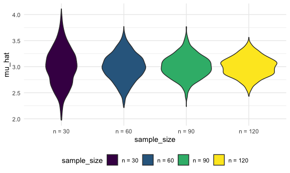

simulation
================
Mukta Patwari
2025-10-30

Load source files

``` r
source("source/sim_mean_sd.R")
```

We can “simulate” by running our function

``` r
sim_mean_and_sd(n_subj = 400)
```

    ## # A tibble: 1 × 2
    ##   mu_hat sigma_hat
    ##    <dbl>     <dbl>
    ## 1   3.08      1.94

can.i “verify” CLT?

``` r
output = vector("list", length = 100)

for (i in 1:100) {
  
  output[[i]] = sim_mean_and_sd(30)
}

output %>% 
  bind_rows() %>% 
  ggplot(aes(x = mu_hat)) +
  geom_density()
```


Try to repeat w/ a map statement

``` r
sim_results_df =
  expand_grid(
    sample_size = c(30, 60, 90, 120),
    iter = 1:1000
  ) %>% 
  mutate(
    results = map(sample_size, sim_mean_and_sd)
  ) %>% 
  unnest(results)
```

Let’s look at this:

``` r
sim_results_df %>% 
  mutate(
    sample_size = str_c("n = ", sample_size),
    sample_size = fct_inorder(sample_size)
  ) %>% 
  ggplot(aes(x = sample_size, y = mu_hat)) +
  geom_violin()
```



Let’s try to summarize

``` r
sim_results_df %>% 
  group_by(sample_size) %>% 
  summarize(
    emp_mean = mean(mu_hat),
    emp_se = sd(mu_hat)
  )
```

    ## # A tibble: 4 × 3
    ##   sample_size emp_mean emp_se
    ##         <dbl>    <dbl>  <dbl>
    ## 1          30     3.00  0.357
    ## 2          60     2.99  0.257
    ## 3          90     3.00  0.216
    ## 4         120     3.00  0.190
